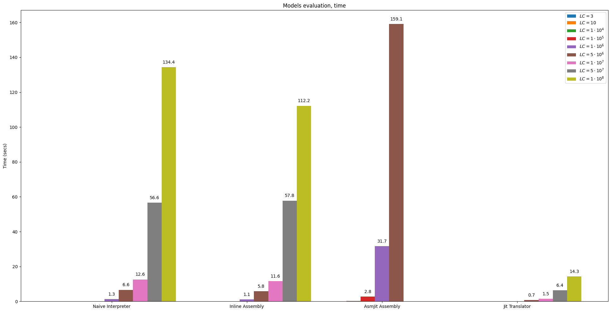

# CPU & OS simulation Elective Course

## What is the course about?

Сourse repository is dedicated to CPU and OS simulation in third bachelor semester at MIPT.

All teaching materials used during the semester are [here](slides/).

## Demo Code

You can find [simulator library](lib/) and [test generation script](test/) here.

During the course we consistently improve our toy model of the simulator.

1. [Naive Interpreter](naive_interpreter/sim.cc)
2. [Inline Assembly model](inline_assembly/sim.cc)
3. [AsmJit Assembly model](asmjit_assembly/sim.cc)
4. [JIT translator](jit_translator/sim.cc)

Here are the results of a comparison of four different models on a [test](test/code.hpp) in which we varied the number of loop iterations (aka LC):

- MIPS:


- Time, seconds:


## Slides

1.  [Introduction](slides/00_Introduction.pdf)
2.  [Software Modeling](slides/01_Software_Modeling.pdf)
3.  [Interpreters](slides/02_Interpreters.pdf)
4.  [Decoder](slides/03_Decoder.pdf)
5.  [ELF](slides/04_ELF.pdf)
6.  [Advanced Interptreters](slides/05_Interpreter+.pdf)
7.  [Full-System Simulation](slides/06_FSS.pdf)
8.  [Trace Driver Simulation](slides/07_TDS.pdf)
9.  [Cycle-Accurate Models](slides/08_CA_models.pdf)
10. [Caches](slides/09_Caches.pdf)
11. [Program Execution Analysis](slides/10_Program_Execution_Analysis.pdf)

## Usage

From the root of source directory configure:

```bash
mkdir -p build/
cmake -B build -S . -DCMAKE_BUILD_TYPE=Release
```

Then run build:

```bash
cmake --build build/ -j<nproc>
```
