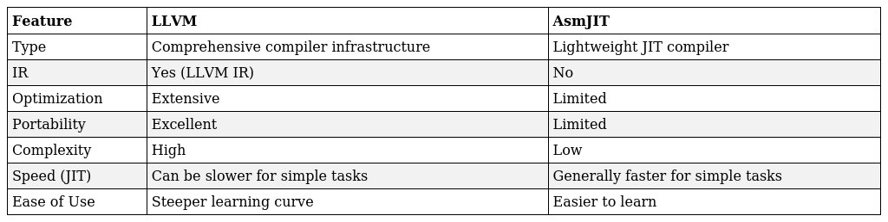

## AsmJit Interpreter

Implementing semantics using inline assembler is definitely a step backwards in terms of the evolution of programming languages. We certainly wouldn't do it that way. However, the optimization worked.

Maybe there is some way to make this easier? Maybe there are already Is libraries for generating host code using C++ code?

- [LLVM](https://llvm.org/doxygen/classllvm_1_1IRBuilder.html)
- [MJIT](https://llvm.org/docs/MCJITDesignAndImplementation.html)
- [AsmJit](https://asmjit.com/)

Here may note that LLVM is a huge compiler project, and AsmJit is a lightweight library for JIT compilation. As well, it's. Suggest take a look at a short summary from ChatGPT and move on.



The assembly capsule for the addition operation from toy ISA now looks like this:

```cpp
case isa::Opcode::kAdd: {
    assembler.mov(asmjit::x86::eax, cpu.regs[insn.src1]);
    assembler.add(asmjit::x86::eax, cpu.regs[insn.src2]);
    //
    assembler.mov(
        asmjit::x86::dword_ptr((size_t)(&(cpu.regs[insn.dst]))),
        asmjit::x86::eax);

    assembler.mov(asmjit::x86::eax, cpu.pc);
    assembler.add(asmjit::x86::eax, 1);

    assembler.mov(asmjit::x86::dword_ptr((size_t)(&cpu.pc)),
                    asmjit::x86::eax);

    assembler.ret();
    break;
}
```

We would like to pay your attention to two details:
- Сapsule changes the state of the entire model, not just the memory.
- When leaving the capsule, do return

By carefully considering the two previous points, you will most likely avoid segfault.

### Benchmark
