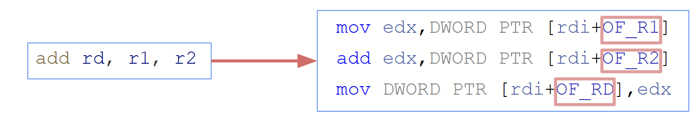

## Inline Assembly Interpreter

While coding the execution stage, you probably thought about at least one of the points

1. It's too boring to code

2. It's applicable for templates

3. It's definitely not the most optimal approach to simulate

Therefore, we introduce a new concept.
A capsule is a block of host code, mapped to one guest instruction



As mentioned, the interpreter:
- Easy to implement and modify
- Simple but slow.

Let's try to apply capsule technology to our toy ISA.
Of course, our code will not become simpler from previous one. Moreover, vice a versa. However, this stage of the simulation evolution is an important step for understanding the following.

And in the first approximation, we will do this in the crudest way - [inline assembly and preprocessor](capsule_asm.hh).

```cpp
#define ARITHM_CAPSULE(op, dst, src1, src2)         \
    asm volatile("mov %[rs1], %%eax\n\t" op         \
                 " %[rs2], %%eax\n\t"               \
                 "mov %%eax, %[rd]\n\t"             \
                 : [rd] "=r"(dst)                   \
                 : [rs1] "r"(src1), [rs2] "r"(src2) \
                 : "%eax");
```

So, let's benchmark our optimization.

### Benchmark

- MIPS:


- Time, seconds:

