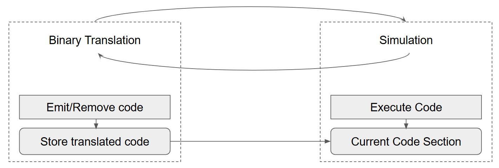
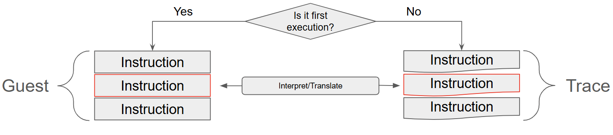
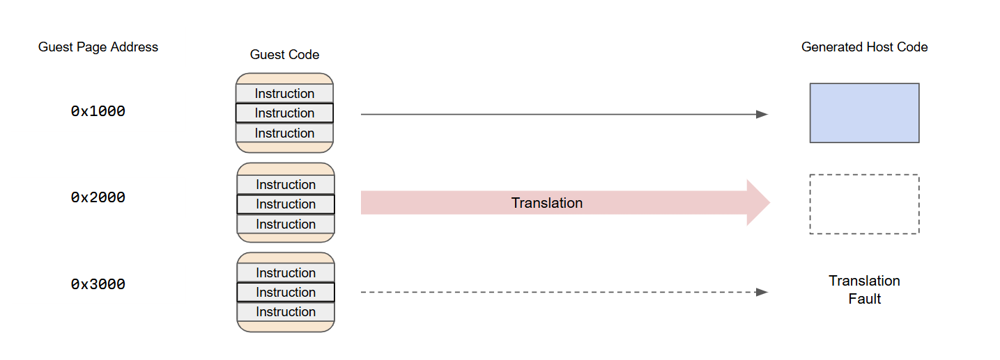
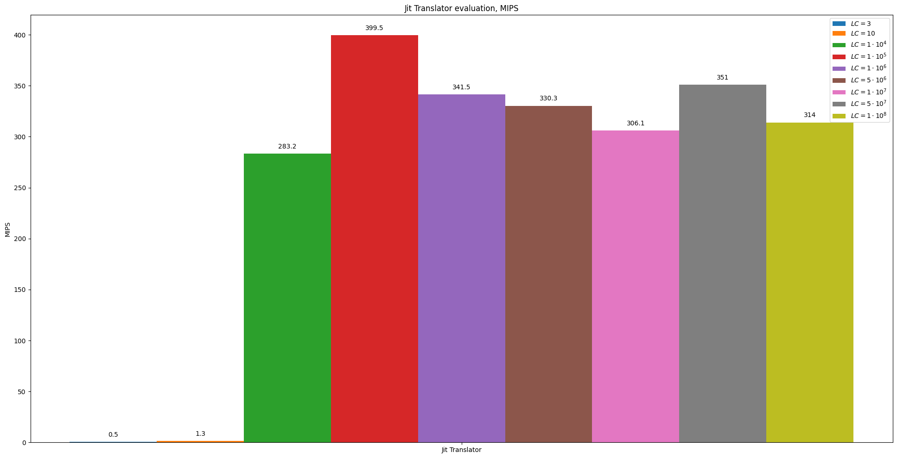
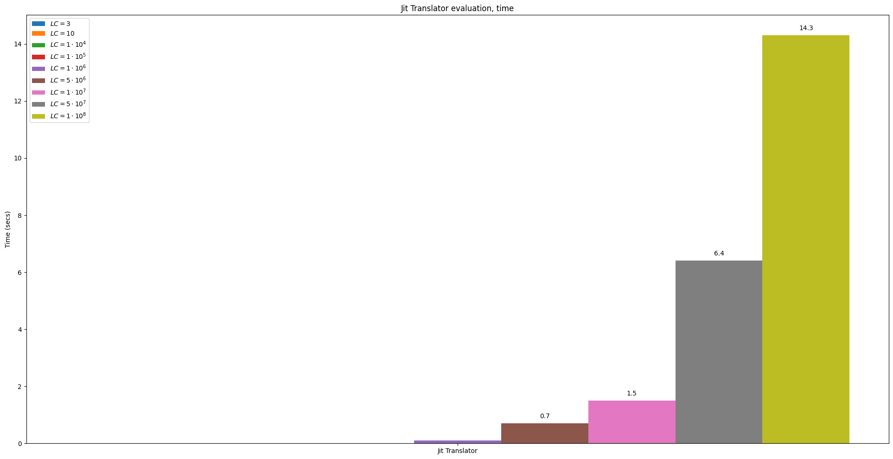

## Dynamic Binary Translation (JIT)
**Binary translation** optimization is based on the idea of ​​"compiling" blocks of target code once and then reusing the results of this work many times. This eliminates the need to interpret instructions at each step of execution.

The guest code is transformed into translation blocks. Each translation block has at least one entry point - the address from which execution starts.

**Recup**: The block of host code obtained for one guest instruction is called a capsule

**Dynamic binary translation** is an approach in which guest system simulation is interspersed with binary translation engine runs for new code blocks that will soon be executed, as well as translation updates for blocks that have changed their contents.

There are different approaches to solving the problem of organizing translation units in dynamic binary translation

* **Traces** : The first execution of each guest instruction is performed using the naive interpreter, and its translation and store of the result in the trace are also performed.

* **Pages** : Instructions located in memory at adjacent addresses are likely to belong to related parts of the program algorithm, will be executed together and can therefore be translated into one block. Translated sections of the host code are reused for previously executed blocks.

In [our implementation](sim.cc) we will use a special case of the first approach, code translation by basic blocks.

**Recup** Basic block -- its a straight-line code sequence with one entry point at the beginning, only one out instruction at the end.

### Benchmark

Let's evaluate perfomance of new approach.

- MIPS:

So, on our synthetic test it showed amazing gain of MIPS.
Based on the bars, it can be noted two obvious things:

- The performance gain becomes significant when the translation overhead is offset by the execution speed of the translated basic blocks.
- On average models with AsmJit translation will reaches about 350 MIPS. To get more we need to apply other optimizations.

- Time, seconds:

