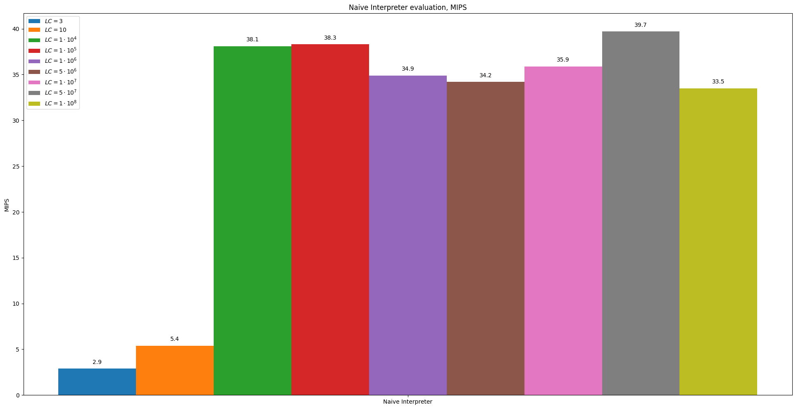
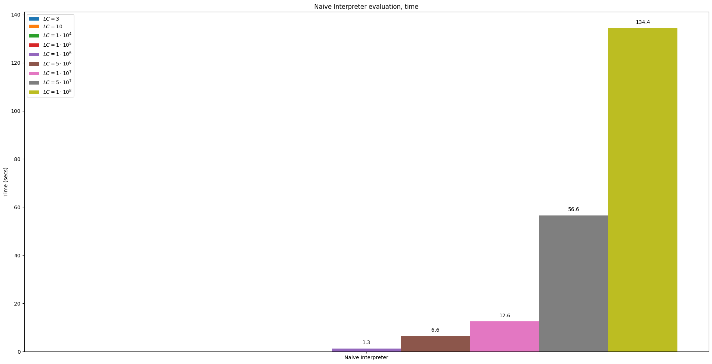

## Naive Interpreter

Interpretation in the general meaning of the word is the translation of text from one language to another.


In this section, we present a functional model of the processor for the toy RISC-like Instruction Set Architecture.

Our toy ISA was described in [```isa.hpp```](../lib/isa/include/sim/isa.hh).

```cpp
enum class Opcode : std::uint8_t {
  kUnknown = 0,
  kAdd,
  kHalt,
  kJump,
  kLoad,
  kStore,
  kBeq,
};
```

The operating algorithm is generally similar to the stage of the command execution pipeline in a real processor:

1. [Fetch](../lib/hart/include/sim/hart.hh#L41)
2. [Decode](../lib/decoder/decoder.cc#L6)
3. [Execute](../lib/hart/include/sim/hart.hh#L48)
4. [Write back](../lib/hart/include/sim/hart.hh#L52)
5. [Advance Program Counter](../lib/hart/include/sim/hart.hh#L78)


The [lecture](../slides/02_Interpreters.pdf) describes the implementation in detail.

Let's take a look at the results of the model's performance for subsequent comparison with the model's optimizations.

### Benchmark

We see that on average, when implementing a naive interpreter, we get no more than **40 MIPS**.

- MIPS:


It's Not bad for a start, but, honestly speaking, the result is quite modest for such a simple command system.

- Time, seconds:

